# TF2 HUD Files Resource File List

#### Hudlayout Entry:
These elements are inside a frame that is positioned in `scripts/hudlayout.res`

| Name                                                                    | File Path                                                                                                 | Image                                                                                         |
|-------------------------------------------------------------------------|-----------------------------------------------------------------------------------------------------------|-----------------------------------------------------------------------------------------------|
| <h4>Engineer Build Menu</h4>                                            | resource/&#8203;ui/&#8203;build_menu/&#8203;hudmenuengybuild.res **[HudMenuEngyBuild]**                | 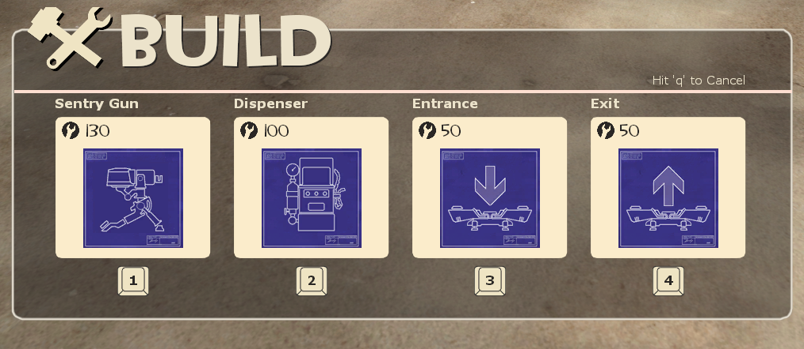                                       |
| <h4>Engineer Destroy Menu</h4>                                          | resource/&#8203;ui/&#8203;destroy_menu/&#8203;hudmenuengydestroy.res **[HudMenuEngyDestroy]**          | 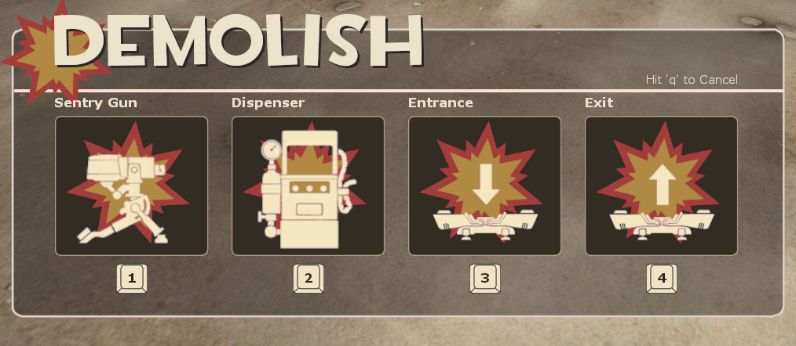                                   |
| <h4>Spy Disguise Menu</h4>                                              | resource/&#8203;ui/&#8203;disguise_menu/&#8203;hudmenuspydisguise.res **[HudMenuSpyDisguise]**         | 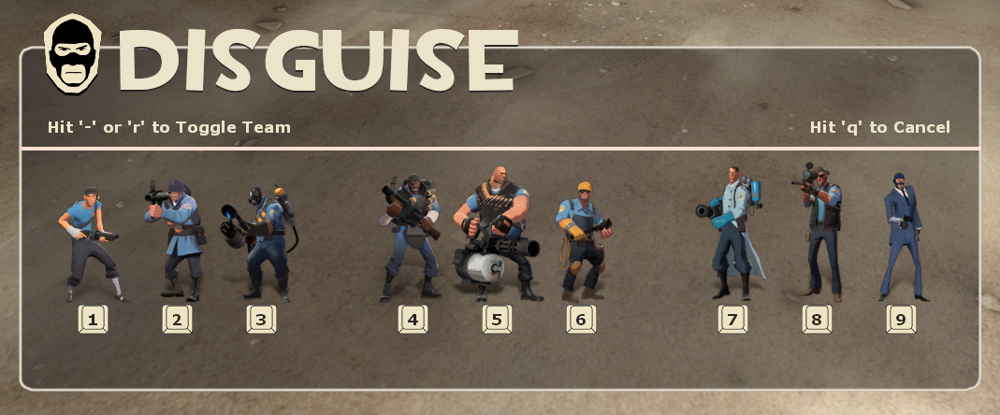                                  |
| <h4>Backpack Menu</h4>                                                  | resource/&#8203;ui/&#8203;econ/&#8203;backpackpanel.res                                                   | 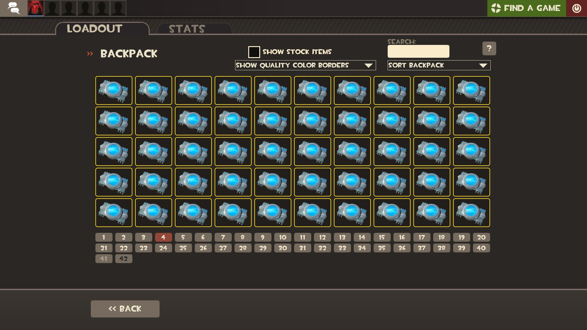                                                |
| <h4>Insect Items & War Paints</h4>                                      | resource/&#8203;ui/&#8203;econ/&#8203;inspectionpanel.res                                                 | 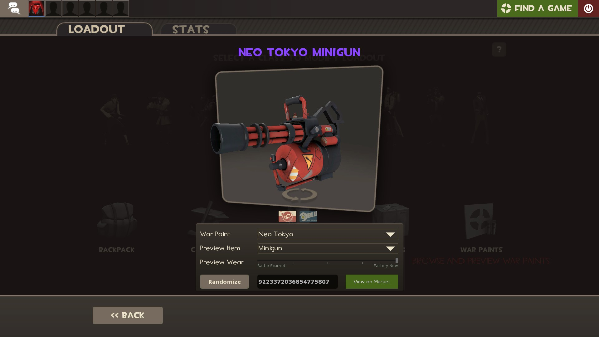                                              |
| <h4>Insect Cosmetics</h4>                                               | resource/&#8203;ui/&#8203;econ/&#8203;inspectionpanel_cosmetic.res                                        | 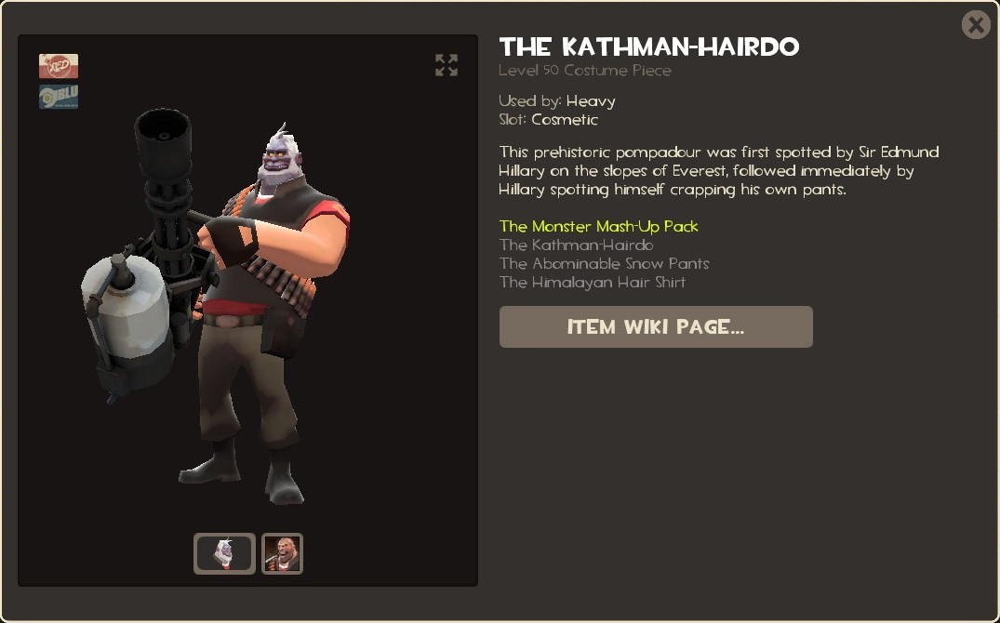                                     |
| <h4>New Item Found Menu</h4>                                            | resource/&#8203;ui/&#8203;econ/&#8203;itempickuppanel.res                                                 | 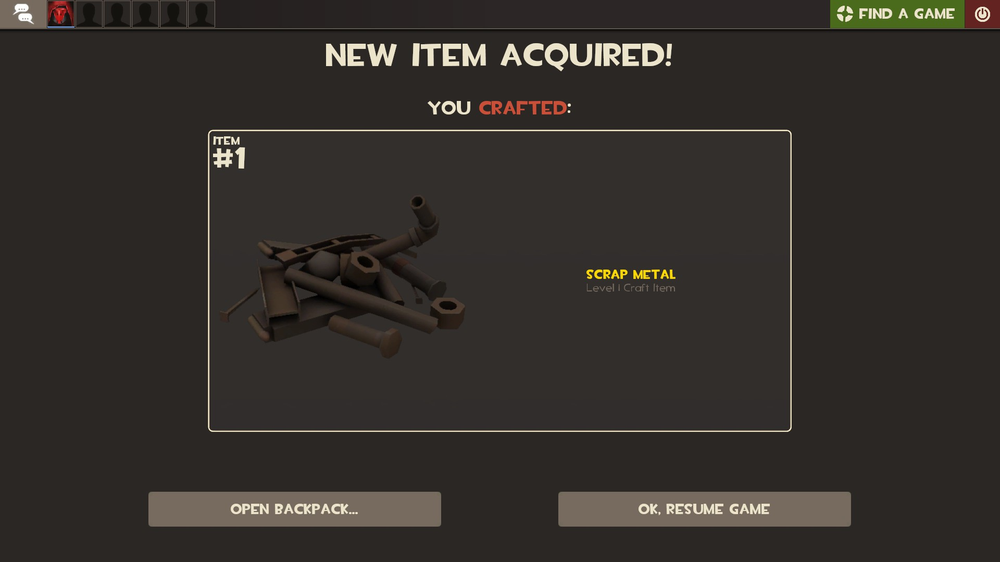                                              |
| <h4>Strange Count Transfer Menu</h4>                                    | resource/&#8203;ui/&#8203;econ/&#8203;strangecounttransferdialog.res                                      | 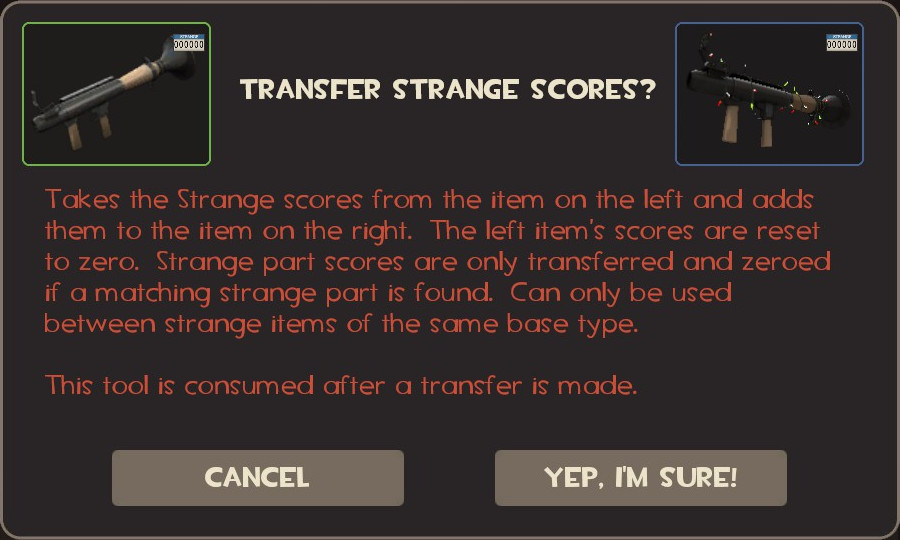                                   |
| <h4>Trading Menu</h4>                                                   | resource/&#8203;ui/&#8203;econ/&#8203;tradingpanel.res                                                    | 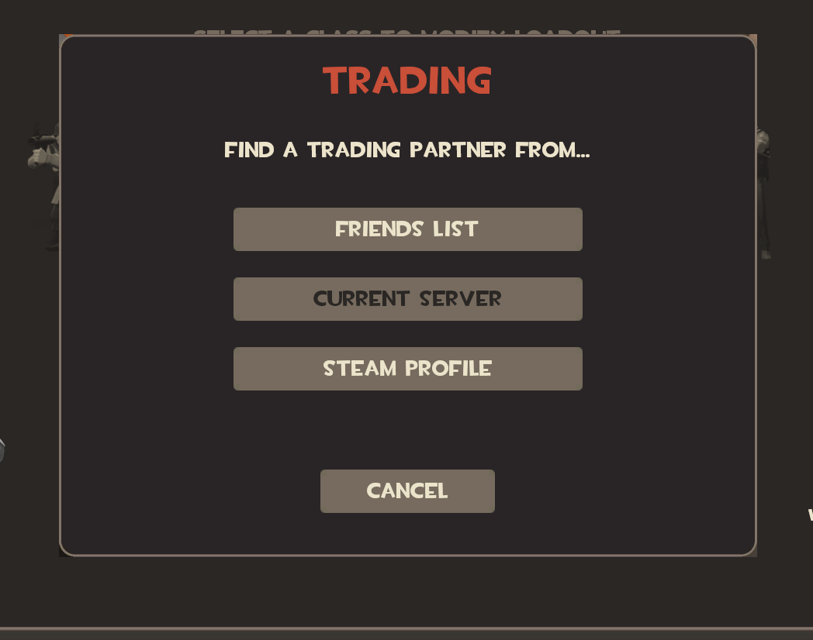                                                 |
| <h4>Report Abuse Menu</h4>                                              | resource/&#8203;ui/&#8203;abusereportsubmitdialog.res                                                     | 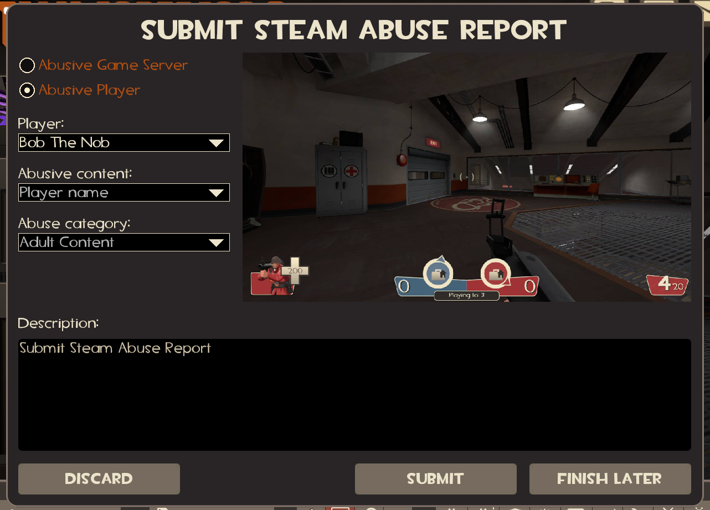                                           |
| <h4>Mann Co Catalogue</h4>                                              | resource/&#8203;ui/&#8203;charinfoarmorysubpanel.res                                                      | 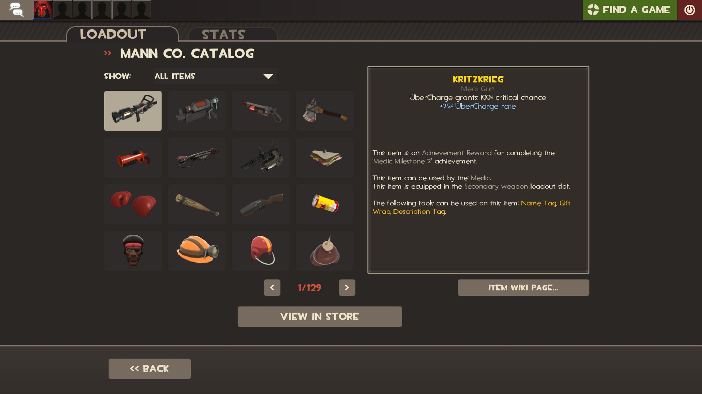                                            |
| <h4>Loadout Menu</h4>                                                   | resource/&#8203;ui/&#8203;charinfoloadoutsubpanel.res                                                     | 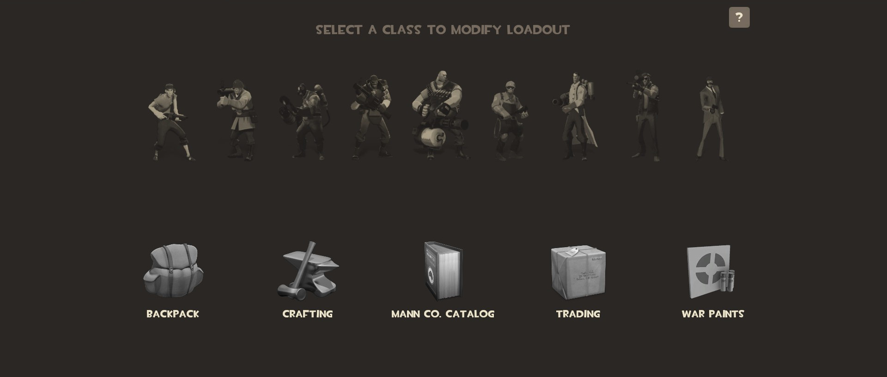                                           |
| <h4>Loadout Header/Footer</h4>                                          | resource/&#8203;ui/&#8203;charinfopanel.res                                                               | 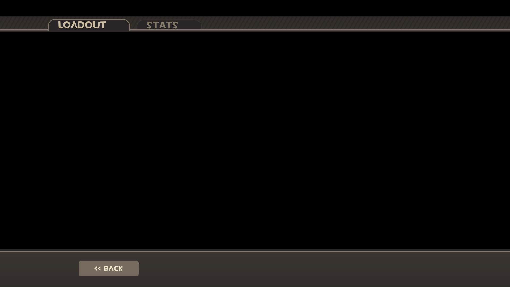                                                     |
| <h4>Class Loadout Menu</h4>                                             | resource/&#8203;ui/&#8203;classloadoutpanel.res                                                           | 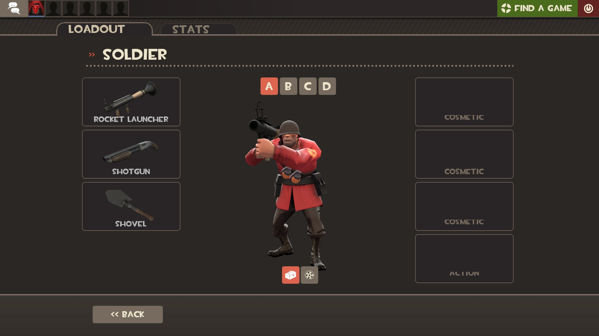                                                 |
| <h4>Class Selection</h4>                                                | resource/&#8203;ui/&#8203;classselection.res                                                              |                                                     |
| <h4>Crafting Menu</h4>                                                  | resource/&#8203;ui/&#8203;craftingpanel.res                                                               | 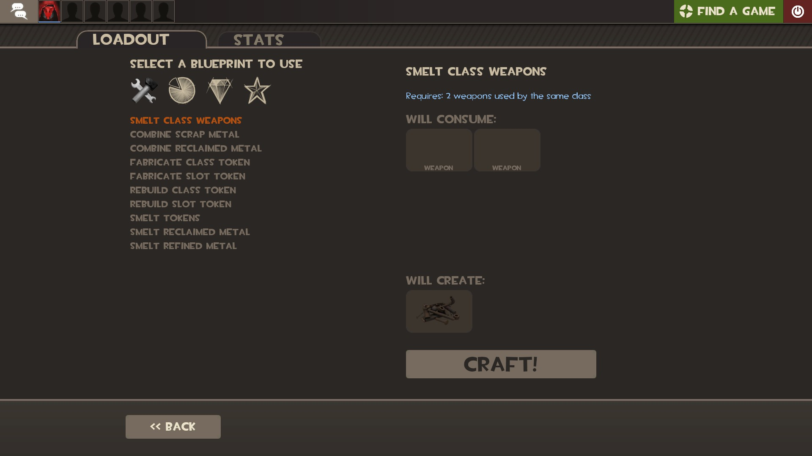                                                     |
| <h4>Crafting Result Modal Box</h4>                                      | resource/&#8203;ui/&#8203;craftingstatusdialog.res                                                        | 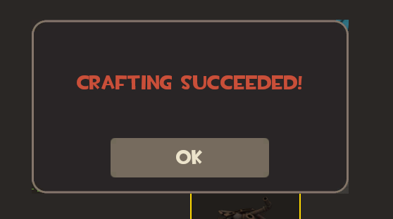                                              |
| <h4>Current Disguise Panel</h4>                                         | resource/&#8203;ui/&#8203;disguisestatuspanel.res                                                         | 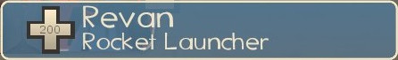                                               |
| <h4>MvM Killstreak Kit Crafting</h4>                                    | resource/&#8203;ui/&#8203;dynamicrecipepanel.res                                                          | 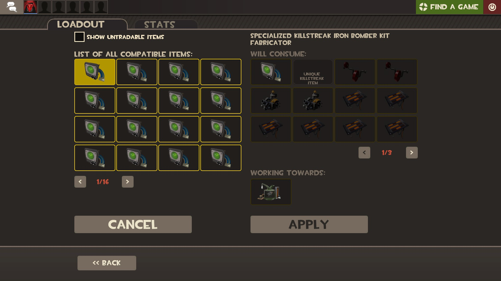                                                |
| <h4>Death Screen</h4>                                                   | resource/&#8203;ui/&#8203;freezepanel_basic.res                                                           |                                                  |
| <h4>Sentry Gun Stats</h4>                                               | resource/&#8203;ui/&#8203;hud_obj_sentrygun.res **[BuildingStatus_Engineer]**                          | 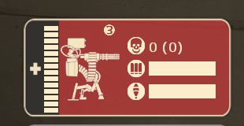                                                 |
| <h4>Metal Status</h4>                                                   | resource/&#8203;ui/&#8203;hudaccountpanel.res **[CHudAccountPanel]**                                   | 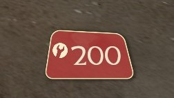                                                   |
| <h4>Ammo</h4>                                                           | resource/&#8203;ui/&#8203;hudammoweapons.res **[HudWeaponAmmo]**                                       |                                                     |
| <h4>Floating Damage Numbers</h4>                                        | resource/&#8203;ui/&#8203;huddamageaccount.res **[CDamageAccountPanel]**                               | 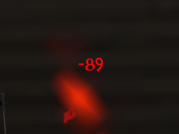                                                  |
| <h4>Demoman Stickies Count</h4>                                         | resource/&#8203;ui/&#8203;huddemomanpipes.res **[HudDemomanPipes]**                                    | 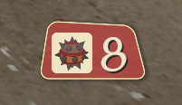                                                   |
| <h4>Health Regenerate Label</h4>                                        | resource/&#8203;ui/&#8203;hudhealthaccount.res **[CHealthAccountPanel]**                               | 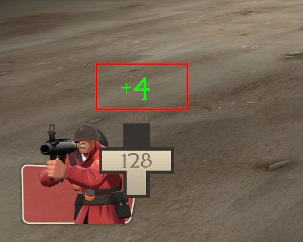                                                  |
| <h4>Generic Charge Meter</h4> [Weapons](#hud-item-effect-meter-weapons) | resource/&#8203;ui/&#8203;huditemeffectmeter.res                                                          | 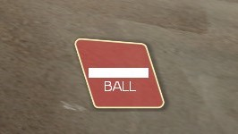                                                |
| <h4>Cleaver Charge Meter</h4>                                           | resource/&#8203;ui/&#8203;huditemeffectmeter_cleaver.res                                                  | 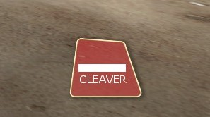                                        |
| <h4>Eyelander Heads Count</h4>                                          | resource/&#8203;ui/&#8203;huditemeffectmeter_demoman.res                                                  |                                         |
| <h4>Frontier Justice Crits Count</h4>                                   | resource/&#8203;ui/&#8203;huditemeffectmeter_engineer.res                                                 | 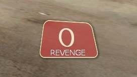                                       |
| <h4>Heavy Knockback Rage Meter</h4>                                     | resource/&#8203;ui/&#8203;huditemeffectmeter_heavy.res                                                    | 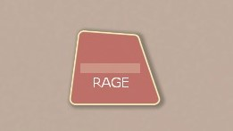                                          |
| <h4>Killstreak Count</h4>                                               | resource/&#8203;ui/&#8203;huditemeffectmeter_killstreak.res                                               | 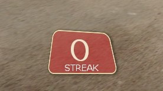                                     |
| <h4>Medic Vita-Saw Organs Count</h4>                                    | resource/&#8203;ui/&#8203;huditemeffectmeter_organs.res                                                   | 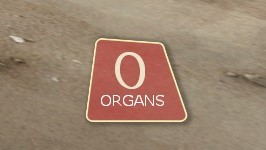                                         |
| <h4>Soldier Cow Mangler 5000 Meter</h4>                                 | resource/&#8203;ui/&#8203;huditemeffectmeter_particlecannon.res                                           | 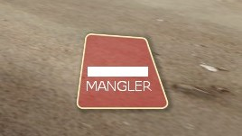                                 |
| <h4>Engineer Pomson 6000 Meter</h4>                                     | resource/&#8203;ui/&#8203;huditemeffectmeter_pomson.res                                                   | 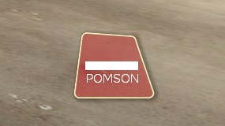                                         |
| <h4>MvM Canteens Count</h4>                                             | resource/&#8203;ui/&#8203;huditemeffectmeter_powerupbottle.res                                            | 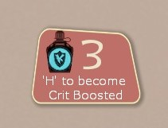                                  |
| <h4>Server Killstreak Announcement</h4>                                 | resource/&#8203;ui/&#8203;hudkillstreaknotice.res                                                         | 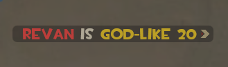                                               |
| <h4>Medic Ubercharge Info</h4>                                          | resource/&#8203;ui/&#8203;hudmediccharge.res **[HudMedicCharge]**                                      | 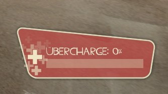                                                    |
| <h4>Taunt Menu</h4>                                                     | resource/&#8203;ui/&#8203;hudmenutauntselection.res **[HudMenuTauntSelection]**                        | 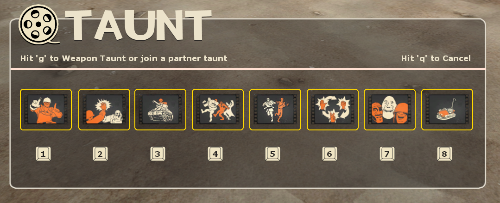                                             |
| <h4>CTF Score Panel</h4>                                                | resource/&#8203;ui/&#8203;hudobjectiveflagpanel.res                                                       | 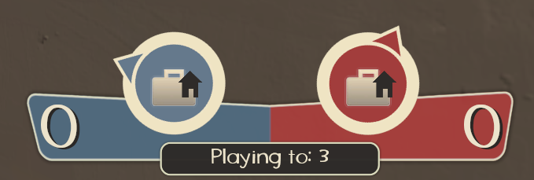                                             |
| <h4>KOTH Time Panels</h4>                                               | resource/&#8203;ui/&#8203;hudobjectivekothtimepanel.res                                                   | 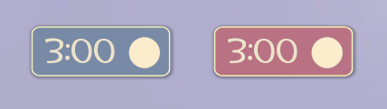                                         |
| <h4>Time Panel</h4>                                                     | resource/&#8203;ui/&#8203;hudobjectivetimepanel.res                                                       | 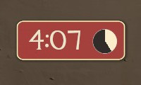                                             |
| <h4>Health</h4>                                                         | resource/&#8203;ui/&#8203;hudplayerhealth.res **[HudPlayerStatus]**                                    |                                                    |
| <h4>Thermal Thruster Status</h4>                                        | resource/&#8203;ui/&#8203;hudrocketpack.res                                                               | 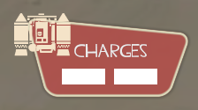                                                     |
| <h4>Tournament Ready Status And Win Conditions Panel</h4>               | resource/&#8203;ui/&#8203;hudtournament.res **[HudTournament]**                                        | 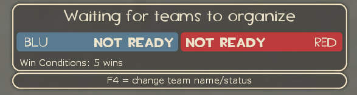                                                     |
| <h4>Tournament Change Team Ready Status Floating Menu</h4>              | resource/&#8203;ui/&#8203;hudtournamentsetup.res **[HudTournamentSetup]**                              | 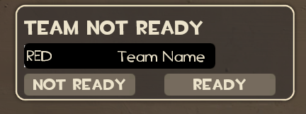                                                |
| <h4>MvM Upgrade Screen</h4>                                             | resource/&#8203;ui/&#8203;hudupgradepanel.res                                                             | 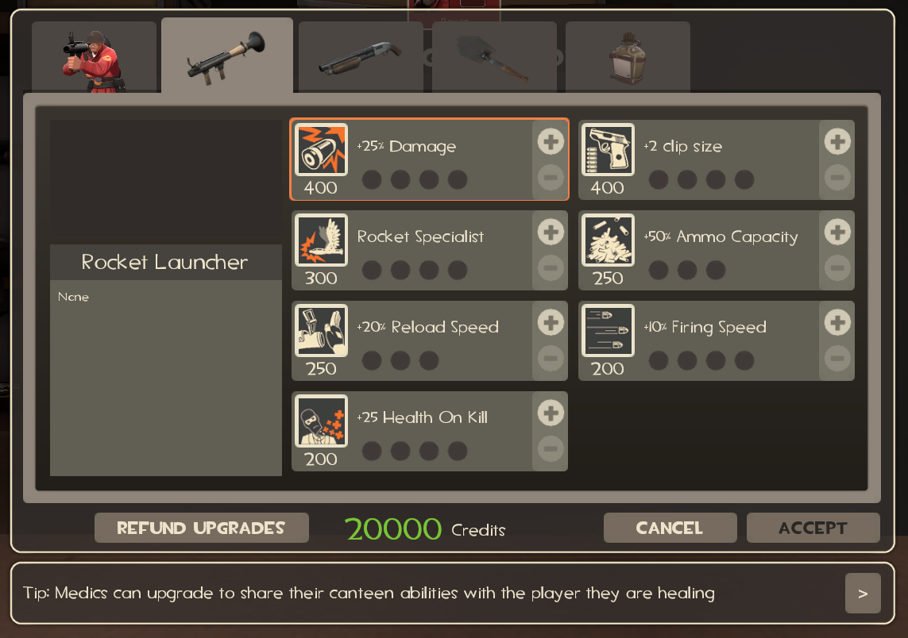                                                   |
| <h4>Queued for game label</h4>                                          | resource/&#8203;ui/&#8203;ingamequeuestatus.res **[QueueHUDStatus]**                                   | 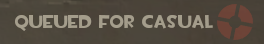                                                 |
| <h4>Item Set Style or Adjust Unusual Panel</h4>                         | resource/&#8203;ui/&#8203;itemoptionspanel.res                                                            |  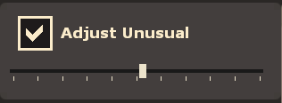 |
| <h4>Loadout Quick Switch Floating Menu</h4>                             | resource/&#8203;ui/&#8203;itemquickswitch.res                                                             | 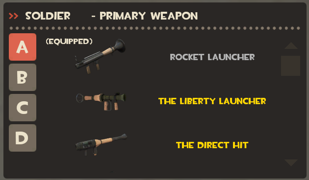                                                   |
| <h4>Confirm Rename Item Menu</h4>                                       | resource/&#8203;ui/&#8203;itemrenameconfirmationdialog.res                                                | 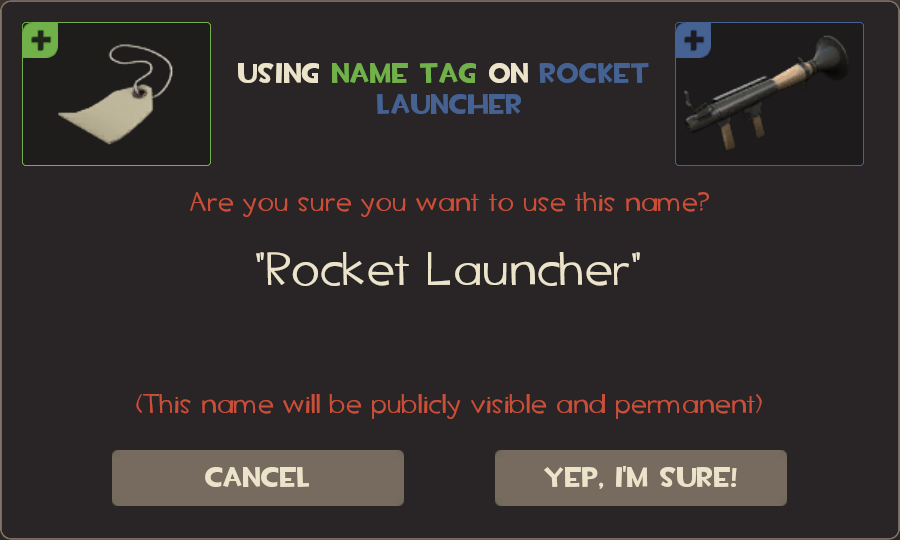                                      |
| <h4>Rename Item Menu</h4>                                               | resource/&#8203;ui/&#8203;itemrenamedialog.res                                                            | 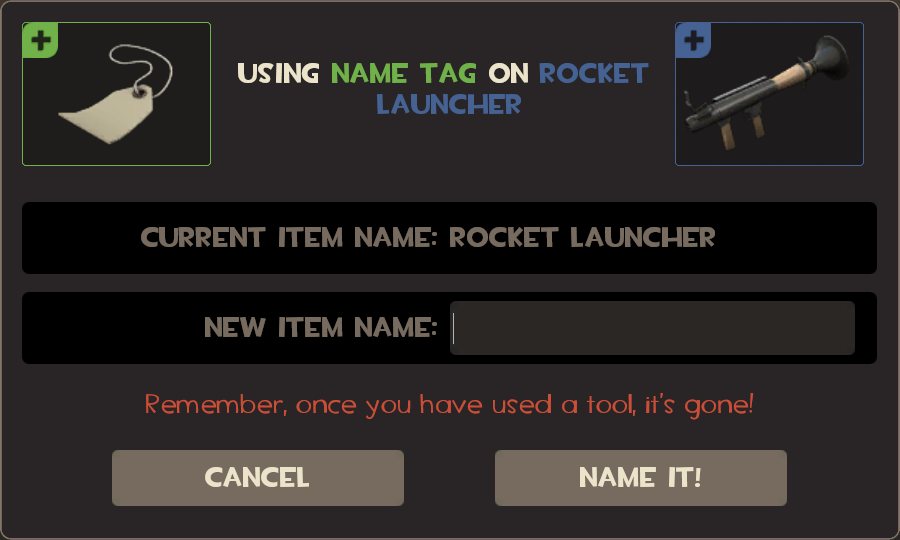                                                  |
| <h4>Rename Item Invalid Name Menu</h4>                                  | resource/&#8203;ui/&#8203;itemrenameinvaliddialog.res                                                     | 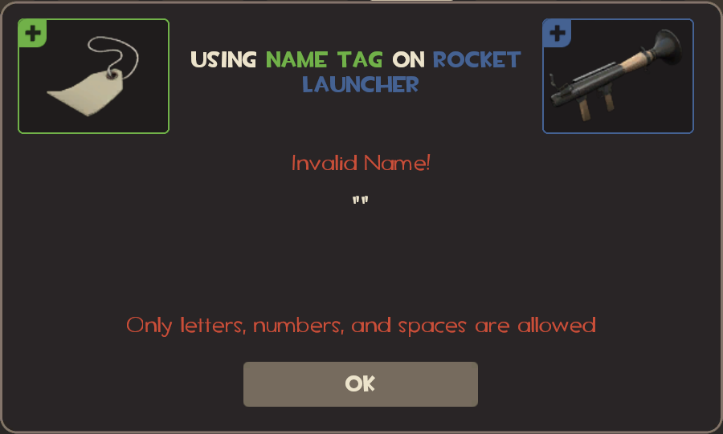                                           |
| <h4>Item Equip Menu</h4>                                                | resource/&#8203;ui/&#8203;itemselectionpanel.res                                                          | 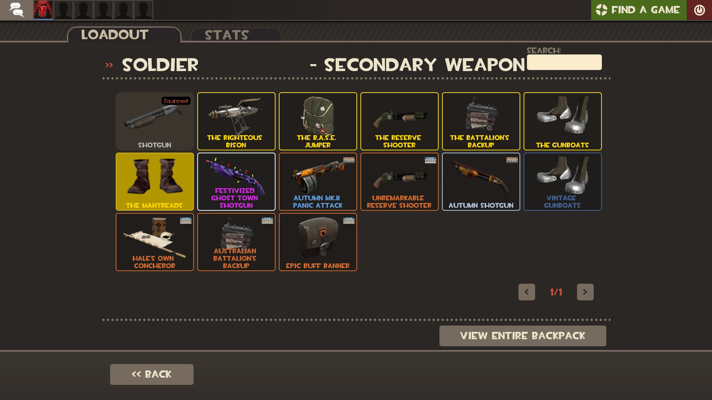                                                |
| <h4>Loadout A B C D Buttons</h4>                                        | resource/&#8203;ui/&#8203;loadoutpresetpanel.res                                                          | 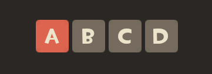                                                |
| <h4>Matchmaking Dashboard Instance Of Gamemode</h4>                     | resource/&#8203;ui/&#8203;mainmenuplaylistentry.res                                                       | 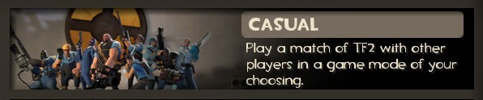                                             |
| <h4>Map Info Menu</h4>                                                  | resource/&#8203;ui/&#8203;mapinfomenu.res                                                                 | 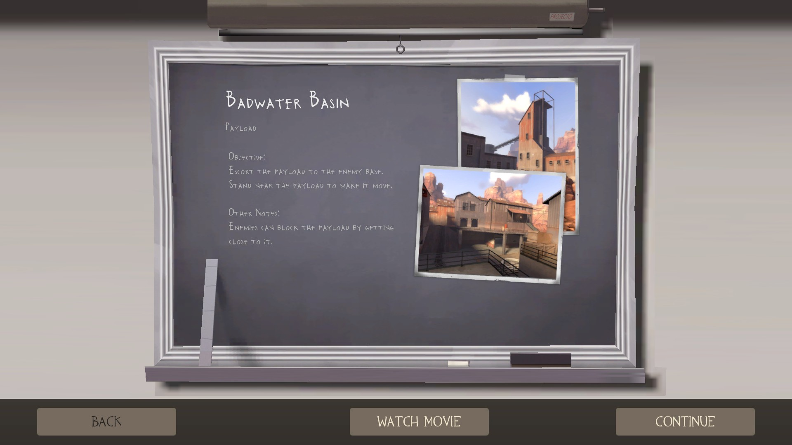                                                       |
| <h4>Matchmaking Top Bar</h4>                                            | resource/&#8203;ui/&#8203;matchmakingdashboard.res                                                        | 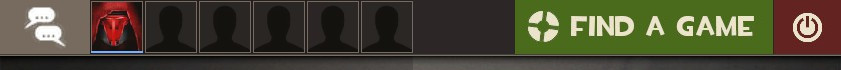                                              |
| <h4>MvM Select Gamemode Type</h4>                                       | resource/&#8203;ui/&#8203;matchmakingdashboardmvmmodeselect.res                                           | 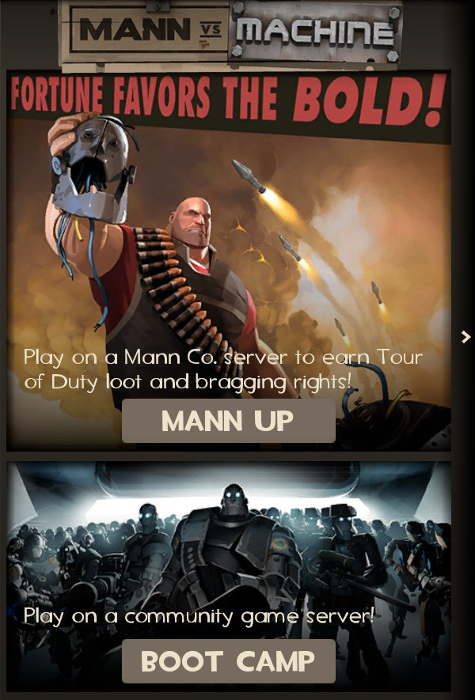                                 |
| <h4>MvM Scoreboard</h4>                                                 | resource/&#8203;ui/&#8203;mvmscoreboard.res                                                               | 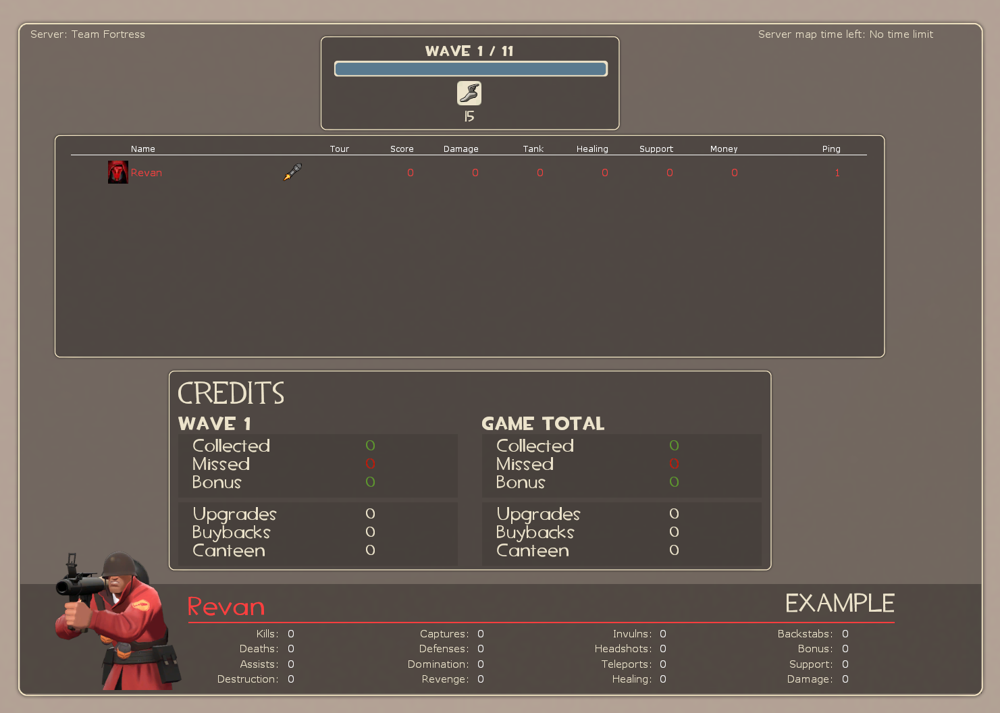                                                     |
| <h4>Payload Cart HUD</h4>                                               | resource/&#8203;ui/&#8203;objectivestatusescort.res                                                       |                                              |
| <h4>Scoreboard</h4>                                                     | resource/&#8203;ui/&#8203;scoreboard.res                                                                  | 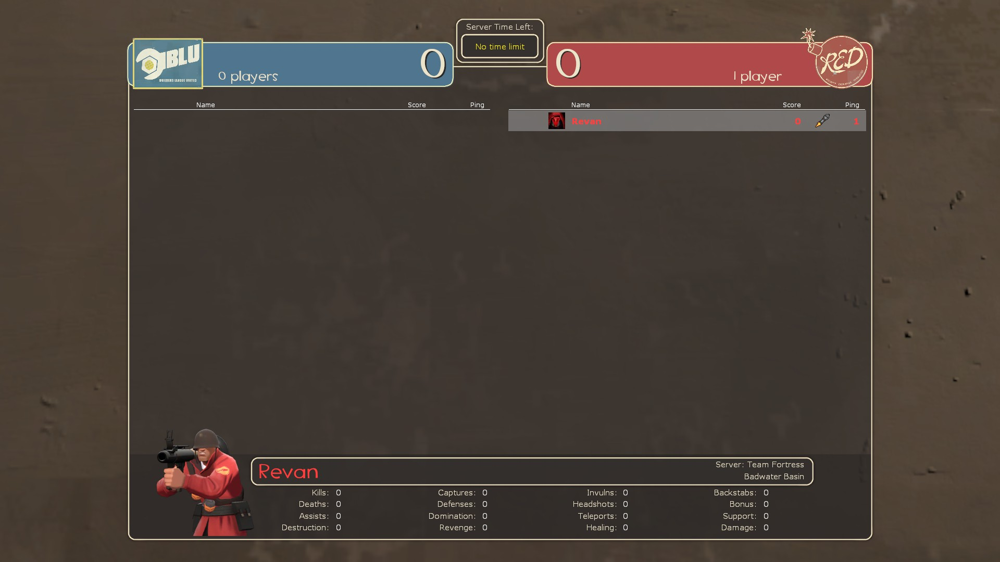                                                        |
| <h4>Loadout Menu Stats</h4>                                             | resource/&#8203;ui/&#8203;statsummary_embedded.res                                                        | 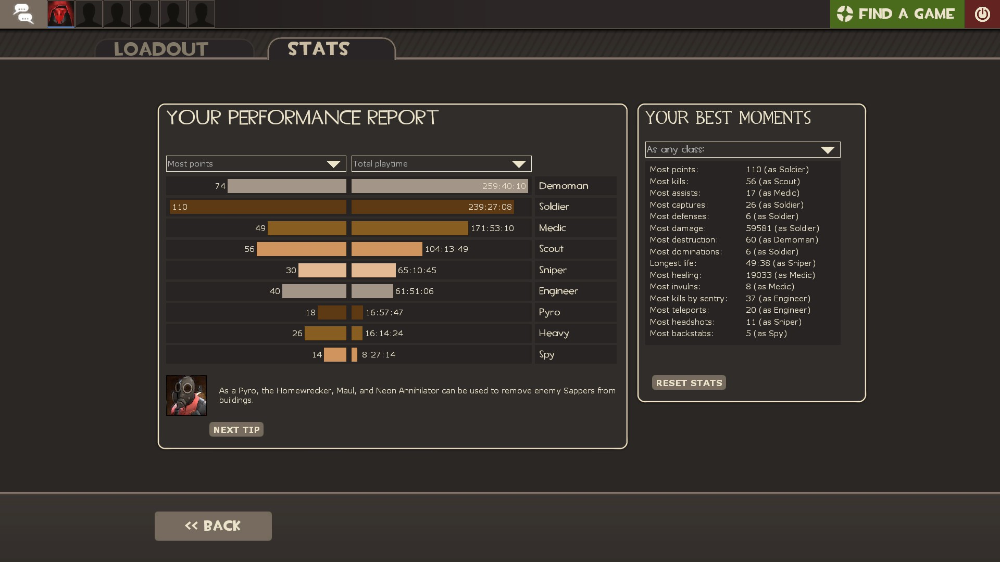                                              |
| <h4>MvM Boss/Tank Health Bar</h4>                                       | resource/&#8203;ui/&#8203;tankprogressbar.res                                                             | 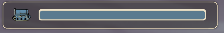                                                   |
| <h4>Main Target ID</h4>                                                 | resource/&#8203;ui/&#8203;targetid.res **[CMainTargetID], [CSpectatorTargetID], [CSecondaryTargetID]** | 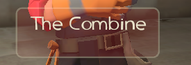                                                          |
| <h4>Select Team Menu</h4>                                               | resource/&#8203;ui/&#8203;teammenu.res                                                                    |                                                           |
| <h4>Intro Menu</h4>                                                     | resource/&#8203;ui/&#8203;textwindow.res                                                                  |                                                         |
| <h4>Advanced Options Menu</h4>                                          | resource/&#8203;ui/&#8203;tfadvancedoptionsdialog.res                                                     | 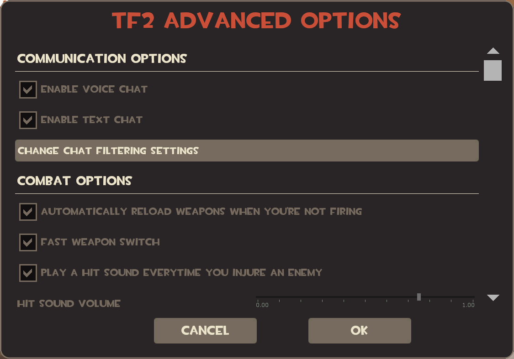                                           |
| <h4>MvM Upgrade Item Panel</h4>                                         | resource/&#8203;ui/&#8203;upgradebuypanel.res                                                             | 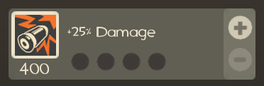                                                   |
| <h4>MvM Wave Win Panel</h4>                                             | resource/&#8203;ui/&#8203;wavecompletesummarypanel.res                                                    | 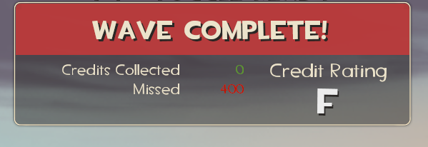                                          |
| <h4>MvM Wave Info</h4>                                                  | resource/&#8203;ui/&#8203;wavestatuspanel.res                                                             | 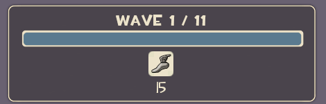                                                   |
| <h4>Round/Game Win Panel</h4>                                           | resource/&#8203;ui/&#8203;winpanel.res **[WinPanel]**                                                  | 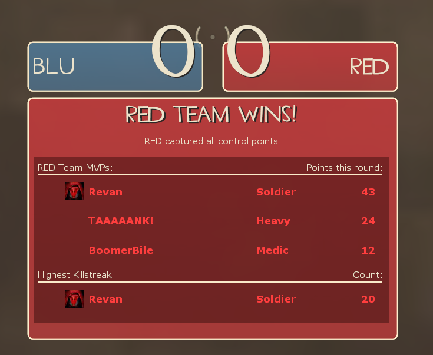                                                          |

### HUD Item Effect Meter Weapons

 - Invis Watch
 - Jarate
 - The Battalion's Backup
 - The Buff Banner
 - The Cloak And Dagger
 - The Concheror
 - The Dead Ringer
 - The Gas Passer
 - The Phlogistinator
 - The Sandman
 - The Sandvich
 - The Wrap Assassin