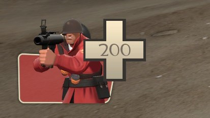
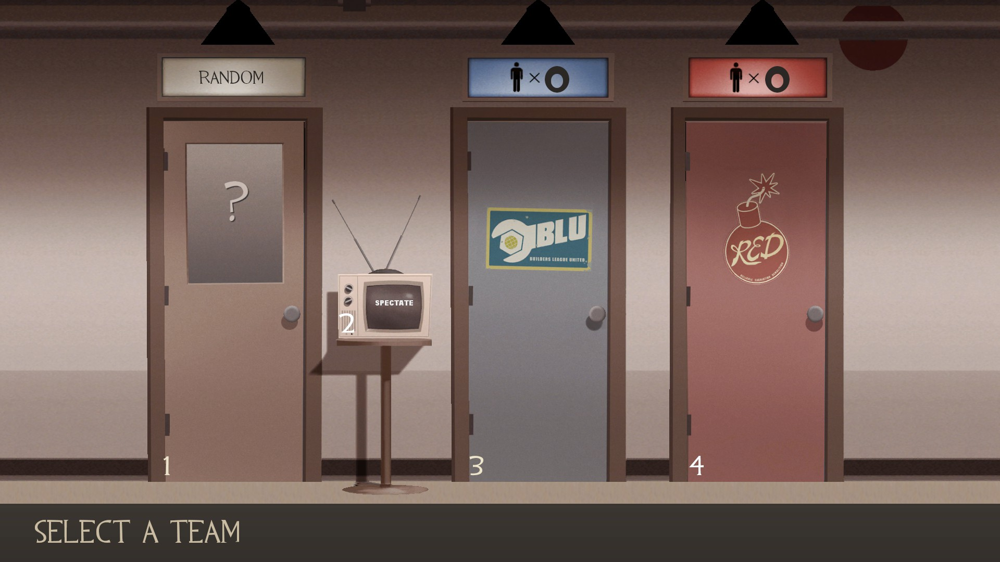

# TF2 HUD Files Resource File List

<table>
	<tr>
		<th>Name</th>
		<th>File Path</th>
		<th>Image</th>
	</td>
	<tr>
		<td>Ammo</td>
		<td>
			<pre>resource/ui/hudammoweapons.res</pre>
		</td>
		<td>
			
		</td>
	</tr>
	<tr>
		<td>Health</td>
		<td>
			<pre>resource/ui/hudplayerhealth.res</pre>
		</td>
		<td>
			
		</td>
	</tr>
	<tr>
		<td>Select Team Menu</td>
		<td>
			<pre>resource/ui/teammenu.res</pre>
		</td>
		<td>
			
		</td>
	</tr>
	<tr>
		<td>Scoreboard</td>
		<td>
			<pre>resource/ui/scoreboard.res</pre>
		</td>
		<td>
			
		</td>
	</tr>
</table>
